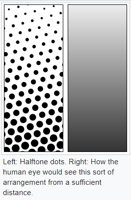
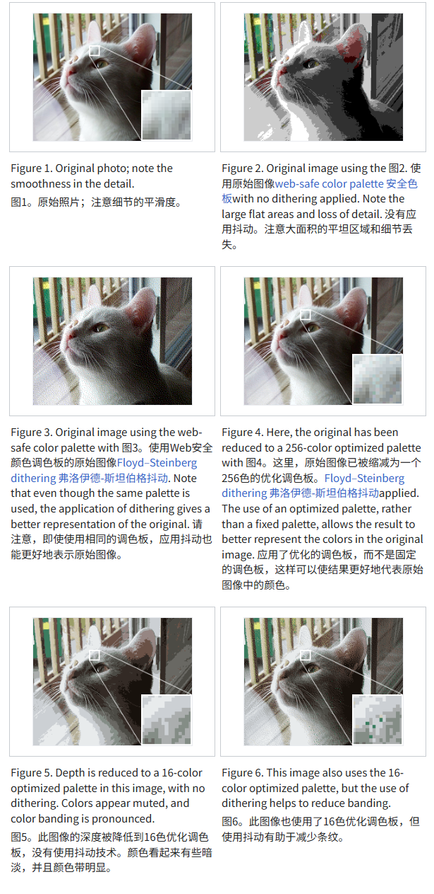

# 半色调（Halftone）风格 

> 就报纸,漫画那种点阵效果

半色调（Halftone）是指为了模拟出连续调影像（色阶）的视觉感觉，一般用墨点（半色调网点）的大小或频率的改变，来模拟明暗的变化。半色调技术是传统印刷中用来处理阶调并模拟连续调（continue tone）的方法，通常也称为过网（screening）技术。

# Dither 抖动
Dither是主动随机噪声掉一些信息后, 在压缩后, 可以获取更接近原始效果;

* 常见用途是将灰度图像转换为黑白图像，以便新图像中黑点的密度近似于原始图像的平均灰度。
* https://en.wikipedia.org/wiki/Dither

https://godotshaders.com/shader/dither-gradient-shader/
https://godotshaders.com/shader/camera-occlusion-dither/

# Halftone（半调）还是 Dither（抖动）
shader成像后, 个人感觉; 很相似, 看起来没有区别; 但是Dither主要还是削减像素 

# 
